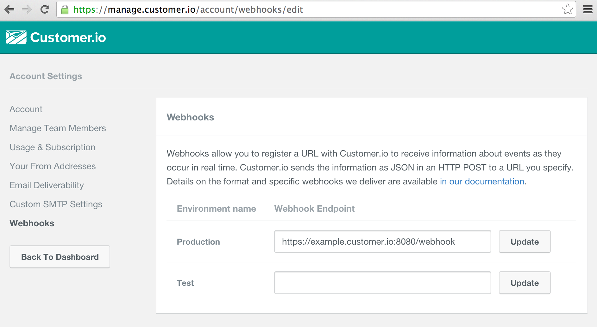

## Re-Routing [Customer.io](http://customer.io) webhooks by type

By default, Customer.io webhooks send to a single URL by environment - this can be overwhelming if you only care about certain endpoints, or if you want to do more intelligent routing. This is an example service that provides this sort of routing.

### Receiving webhooks from Customer.io

Webhooks on customer.io are delivered in a JSON format (example below) and come in a variety of different types.

```json
{
    "event_type": "email_delivered",
    "event_id": "9420f522-b127-4a74-8b90-bace0edc27ab",
    "timestamp": 1422290032,
    "data": {
        "customer_id": "568",
        "email_address": "customer@example.com",
        "email_id": "34",
        "subject": "Why haven't you visited lately?",
        "campaign_id": "33",
        "campaign_name": "Inactivity Teaser"
    }
}
```

you can read more about Customer.io webhooks, including a full list of types here: [http://customer.io/docs/webhooks.html](http://customer.io/docs/webhooks.html), which includes a description of the format of all of our individual webhook types and the data they provide.

### Routing requests

Because we supply ```event_type``` with every webhook, you should be able to simply parse the body of the incoming request as JSON, and then forward the request based on the value of the ```event_type``` field. In the example, this is handled with a simple dictionary (associative array) that maps each type to an outbound URL.

We recommend that you return the response of the downstream service (the one being forwarded the webhook request) as the response to Customer.io - this will ensure that we know that you were able to process our webhooks successfully!

### Running the example server

To run the example server, you will need Golang 1.4 installed, then run the following:

```bash
# Retrieves the necessary dependencies, Segment.com's official Golang API client
go get
# Builds a binary
go build webhook_rerouting_server.go
# Runs the server on port localhost:8080
./webhook_rerouting_server
```

Then visit the [customer.io webhook integration](https://manage.customer.io/account/webhooks/edit) page and point the webhooks for your desired environment to the server that is hosting this service, it will be listening on port 8080 at the path /webhook, see below:



