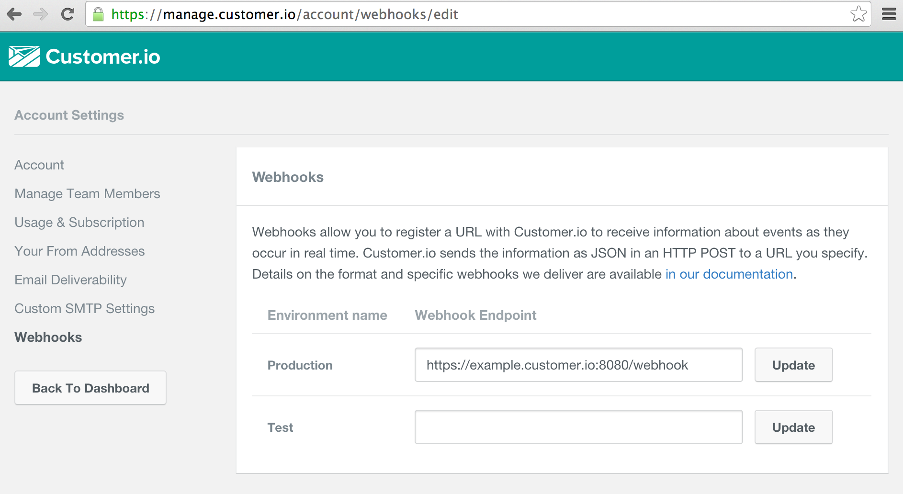

## Routing [Customer.io](http://customer.io) webhooks to [Segment.com](http://segment.com)

For customers integrating with Customer.io using the integration tools at Segment.com, it can sometimes be useful to be able to relay email information back through to Segment. This can be easily accomplished using Customer.io webhooks and an HTTP service.

### Receiving webhooks from Customer.io

To route the requests, you will need to run a service that accepts Customer.io webhooks and translates them into a format that is understandable by the Segment.com API. A very simple example (in Golang) can be see in [segment_routing_server.go](segment_routing_server.go) in this folder. It is designed to accept customer.io webhook requests, which are basic HTTP requests that send a JSON body that looks like the following:

```json
{
    "event_type": "email_delivered",
    "event_id": "9420f522-b127-4a74-8b90-bace0edc27ab",
    "timestamp": 1422290032,
    "data": {
        "customer_id": "568",
        "email_address": "customer@example.com",
        "email_id": "34",
        "subject": "Why haven't you visited lately?",
        "campaign_id": "33",
        "campaign_name": "Inactivity Teaser"
    }
}
```

you can read more about Customer.io webhooks here: [http://customer.io/docs/webhooks.html](http://customer.io/docs/webhooks.html), which includes a description of the format of all of our individual webhook types and the data they provide.

### Routing webhooks back to Segment.com

Segment provides an API for sending "track" requests [https://segment.com/docs/api/tracking/track/](https://segment.com/docs/api/tracking/track/) into their system, which is what we will use to reroute the customer.io webhook. A basic segment track request requires the following data to be sent (this is how the above customer.io JSON will be translated)

```json
{
    "userId":     "568",
    "event":      "customerio:email_delivered",
    "properties": {
        "customer_id": "568",
        "email_address": "customer@example.com",
        "email_id": "34",
        "subject": "Why haven't you visited lately?",
        "campaign_id": "33",
        "campaign_name": "Inactivity Teaser"
    },
    "context": {
        "event_id": "9420f522-b127-4a74-8b90-bace0edc27ab",
    },
    "timestamp": 1422290032,
}
```

When sending to the Segment API, the "data" parameter of the webhook gets translated to "properties", and in order to ensure the event doesn't conflict with other events you may be tracking, we recommend adding a "customerio:" prefix to the event type. You may also consider adding additional data to the "context" parameter in order to better identify that these events are being sent by Customer.io.

We recommend using one of Segment's [official API libraries](https://segment.com/docs/libraries/) to interact with their API to ensure that your code will be compatible with their API.

### Running the example server

First you will need to replace the line ```const SEGMENT_WRITE_KEY = "<YOUR KEY HERE>"``` with your actual Segment.com write key, which you can find under the "Project Settings" menu option in the "Api Keys" tab

To run the example server, you will need Golang 1.4 installed, then run the following:

```bash
# Retrieves the necessary dependencies, Segment.com's official Golang API client
go get
# Builds a binary
go build segment_routing_server.go
# Runs the server on port localhost:8080
./segment_routing_server
```

Then visit the [customer.io webhook integration](https://manage.customer.io/account/webhooks/edit) page and point the webhooks for your desired environment to the server that is hosting this service, it will be listening on port 8080 at the path /webhook, see below:



